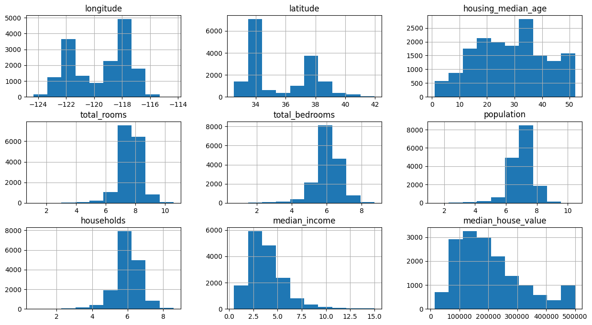
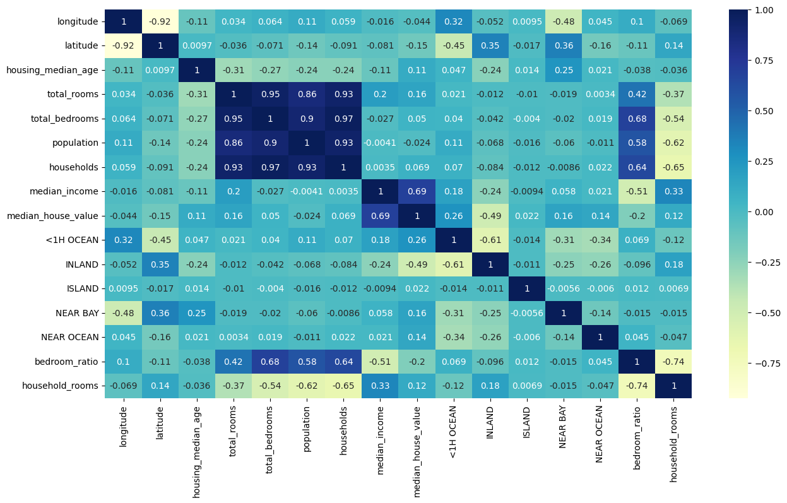
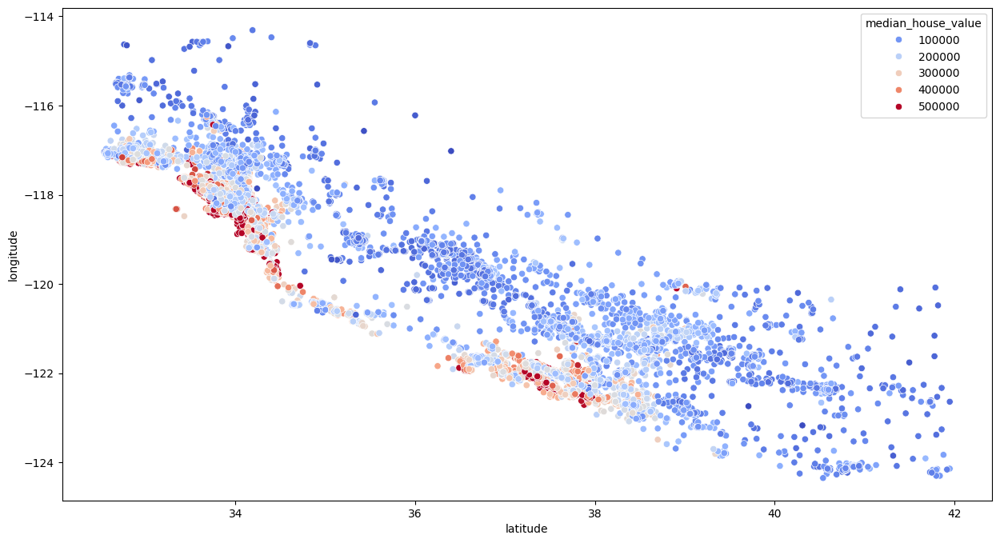

# House-Price-Prediction

## Table of Contents

1. [Introduction](#introduction)
2. [Prerequisites](#prerequisites)
3. [Data Overview](#data-overview)
4. [Data Science Process](#data-science-process)
   - [Exploring the Dataset](#exploring-the-dataset)
   - [Preprocessing the Data](#preprocessing-the-data)
   - [Feature Engineering](#feature-engineering)
   - [Model Training](#model-training)
   - [Model Evaluation](#model-evaluation)
5. [Findings](#findings)
6. [Graphs and Visualizations](#graphs-and-visualizations)
7. [Key Components](#key-components)
8. [Conclusion](#conclusion)

## Introduction

In this project, we will go through the complete data science process using the California housing prices dataset from Kaggle. The steps include exploring the dataset, preprocessing the data, engineering custom features, training models, and evaluating their performance. This guide is intended for beginners in data science and machine learning, but it also introduces some advanced concepts.

## Prerequisites

- Working IPython notebook environment (Jupyter Notebook, Jupyter Lab, or IPython notebooks in VS Code/PyCharm)
- Basic data science libraries: NumPy, Pandas, Matplotlib, Seaborn, Scikit-learn

## Data Overview

The dataset contains features like coordinates, median age, total rooms, total bedrooms, population, and households, with the target variable being the median house

## Data Science Process

### Exploring the Dataset

1. Load the dataset using Pandas.
2. Inspect the data for missing values and basic statistics.
3. Visualize the data distributions and correlations.

### Preprocessing the Data

1. Handle missing values by dropping rows with NaN values.
2. Scale skewed features using logarithmic transformation.
3. Convert categorical features (e.g., ocean proximity) into numerical values using one-hot encoding.

### Feature Engineering

1. Create new features by combining existing ones (e.g., bedroom ratio, rooms per household).
2. Analyze the correlation of new features with the target variable.

### Model Training

1. Train a simple linear regression model.
2. Train a random forest regressor and perform hyperparameter tuning using GridSearchCV.

### Model Evaluation

1. Evaluate models using metrics such as R-squared score.
2. Compare the performance of different models and hyperparameters.

## Findings

- The median income has a high correlation with the median house value.
- Proximity to the ocean positively affects house prices, while inland locations have a negative impact.
- New features like bedroom ratio and rooms per household show significant correlation with house prices.

## Graphs and Visualizations

1. **Histograms** of feature distributions before and after transformation.
   
2. **Correlation Heatmap** showing the relationship between features and the target variable.
   
3. **Scatter Plot** of house values based on coordinates, colored by price.
   

## Key Components

- **Data Exploration:** Understanding the dataset and initial findings.
- **Preprocessing:** Cleaning and preparing the data for modeling.
- **Feature Engineering:** Creating meaningful features to improve model performance.
- **Model Training and Evaluation:** Building and testing machine learning models.

## Conclusion

This project demonstrates the full workflow of a data science project, from data exploration to model evaluation. While simple linear regression provides a baseline, more complex models like random forests can significantly improve prediction accuracy. However, careful preprocessing and feature engineering are crucial for optimal performance. Further improvements can be made by exploring more sophisticated models and additional feature engineering.
